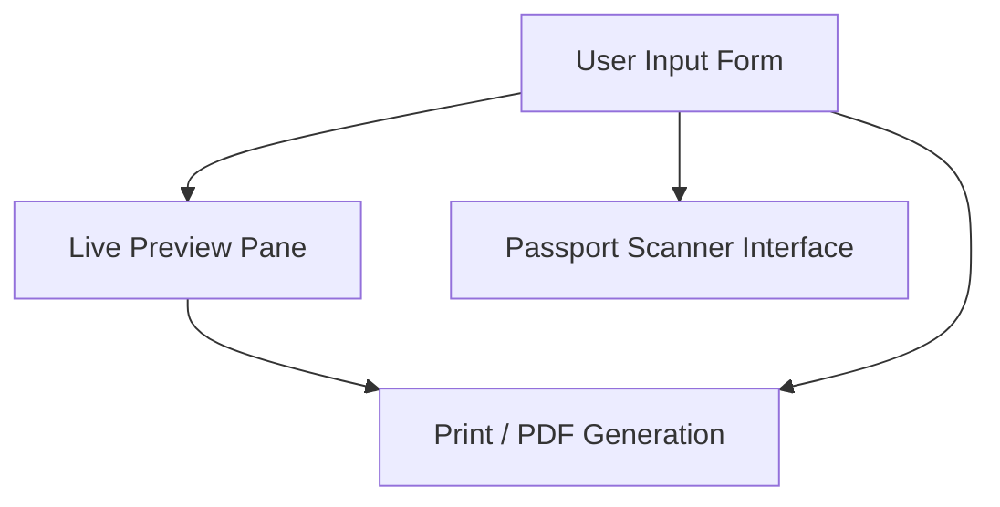

# Fly To Way (flytoway.com) - Comprehensive Features & Services Document

This document compiles the features, web application capabilities, and service offerings of **Fly To Way** based on a detailed visual and structural DOM inspection of their platform.

---

## 1. Executive Summary & Brand Overview

* **Brand Name:** Fly To Way (also represented as Fly To Way Travels)
* **Core Industry:** Travel & Tourism / Hospitality Booking Solutions
* **Primary Focus:** Hajj & Umrah Pilgrimage Travels and custom travel document generation utility services.
* **Business Model:** Hybrid travel agency offering direct tourism/pilgrimage package booking combined with open-access web utilities for booking validation, invoice preparation, and travel voucher creation.

---

## 2. Platform Web Application & Tooling

The website contains custom, interactive web applications built to facilitate passenger management and document distribution.

### 2.1 E-Ticket Voucher Generator (`/e-tickets/`)
A public-facing interactive tool designed to dynamically compose, format, preview, and generate airline electronic ticket vouchers.

* **Ticket Record Data**:
  - Voucher/Booking Reference Number fields.
  - Status management dropdowns (e.g., Confirmed, Pending, Ticketed).
* **Airline Routing Details**:
  - Airline search/selection tools displaying airline logos and resolving IATA carrier codes.
* **Passenger Management**:
  - **Passenger Details**: Fields for Title, Given Name, Surname, Date of Birth, Passport Number, Passport Expiry, Nationality, PNR, and Status.
  - **Scan Passport Integration**: Built-in option to scan or upload passenger passport images to extract data fields.
  - **Multi-Passenger Support**: Dynamic addition of multiple passenger records to a single booking document.
* **Sector / Flight Journey Route Planner**:
  - **Trip Types:** Support for One-Way, Return, and Multi-City configurations.
  - **Sector Details:** Flight Number, Origin City (From), Destination City (To), Depart/Arrive Dates, and Depart/Arrive Times.
  - **Multi-Sector Support:** Dynamic addition of multiple flight legs.
* **Fare, Service, and Baggage Details**:
  - **Cabin Class Selection**: Economy, Premium Economy, Business, or First Class.
  - **Baggage Allowance:** Fields for Checked and Cabin Hand Baggage.
  - Meal preferences and specific seat numbers.
* **Voucher Actions**:
  - **Live Ticket Preview**: Real-time rendering area matching the printed design.
  - **Print / Download PDF**: Export features that format the voucher into a clean, print-friendly digital PDF file.
  - **History Search**: Allows filtering saved tickets by Passenger Name, PNR, or Voucher Number.

### 2.2 Restricted Travel Management Portal (`/fly-to-way-e-ticket/`)
* A secure backend interface designed for administrative travel agents.
* **Access Requirements:** Login credentials required. Once logged in, agents can record sales, track customer details, and store booking logs directly into the agency database.

### 2.3 Hotel Booking Confirmation Voucher Generator (`/hotel-vocher-generator/`)
A custom web utility optimized to generate hotel booking confirmation slips, heavily tailored for Hajj and Umrah pilgrims staying in Saudi Arabia.

* **Voucher & Client Details**:
  - Fields for Booking Reference, Status, Issue Date, Client/Company Name, and Primary Guest Name.
* **Accommodation Grid (Multi-Stay Support)**:
  - **Location-Specific Dropdowns**: Optimized for cities like Makkah and Madinah.
  - Hotel details input fields (Hotel Name, Star Category, HCN Hotel Confirmation Number).
  - **Room Settings:** Room Type (Double, Triple, Quad, etc.) and Room View (Kaaba View, Haram View, City View, etc.) with custom override fields.
  - **Meal Plan Options:** Room Only (RO), Bed & Breakfast (BB), Half Board (HB), Full Board (FB).
  - **Check-in/out Dates:** Automatic calculation of stay length (Total Nights).
  - **Multi-Stay Accommodation Log:** Allows listing multiple hotel bookings in a sequence (e.g., Makkah stay followed by Madinah stay) on a single voucher sheet.
* **Emergency & Ground Contacts**:
  - Pre-defined slots for Makkah and Madinah ground support representatives (names and WhatsApp numbers).
* **Company Terms & Custom Signatures**:
  - Signatory details for booking validation.
  - Standard notes sections describing check-in/out protocols, cancellation rules, and pilgrimage guidelines.
* **Actions:** Reset form, preview live layout, and download/save PDF.

### 2.4 Maheen Aviation Hotel Voucher Generator (`/maheen-hotel/`)
* An alternative interface of the Hotel Voucher Generator custom-branded for **Maheen Aviation**.
* Standardized with preloaded Maheen Aviation logo, preset terms, and a default "M-" voucher prefix.

---

## 3. Pilgrimage Services Portfolio (Hajj & Umrah)

Offline and package booking operations highlight the agency's operational services in pilgrimage travel:

| Service Area | Details & Offerings |
| :--- | :--- |
| **Visa Services** | Processing and documentation guidance for Saudi Hajj & Umrah Visas. |
| **Accommodation Packages** | Room bookings at proximity-optimized hotels in Makkah and Madinah. |
| **Ground Logistics** | Airport transfers (Jeddah / Madinah) and shuttle logistics between cities. |
| **Guided Pilgrimages** | Accompaniment by certified Mutawwifs (pilgrimage guides) to direct rituals. |
| **General Tourism** | Multi-destination flights, holiday trip packages, and global air bookings. |

---

## 4. Platform Tech Stack & CMS Overview

* **CMS/Platform:** WordPress (utilizing Astra Theme for clean, fast page loading).
* **Visual Builders & Design Blocks:** Custom UI components built using HTML/CSS forms and JS generator engines.
* **Integrations:** Social chat features (WhatsApp links) and PDF generation libraries.
